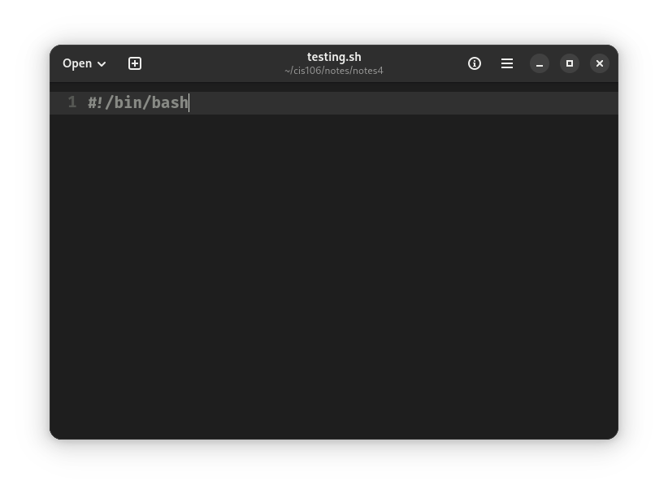
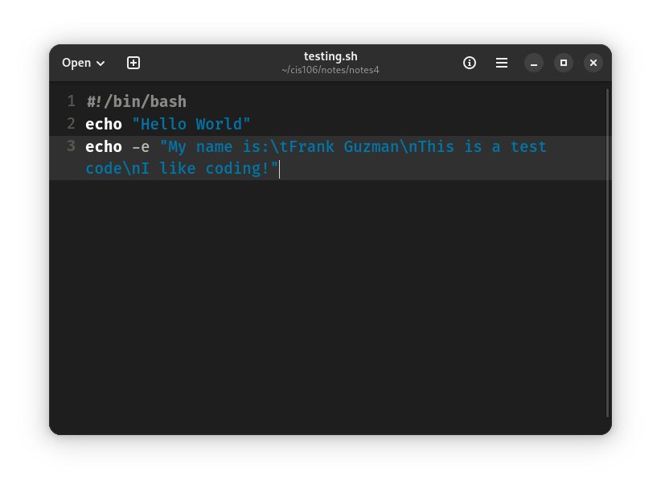
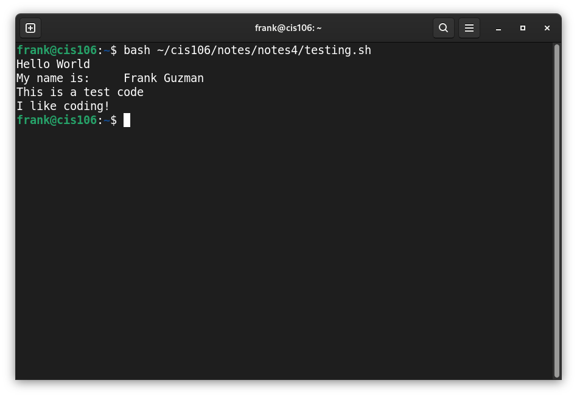
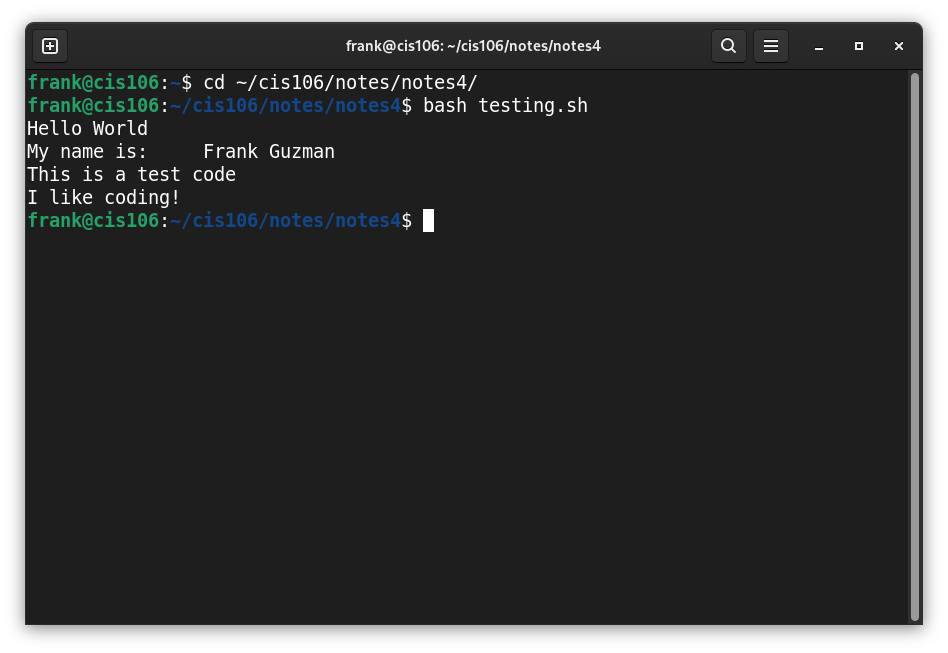

# Notes 4

#### **How to install and remove software using the APT command**
To *install* software, you would type: ```sudo apt install package_name```
To *remove* software, you would type: ```sudo apt remove package_name```


#### **How to create a shell script step-by-step**
1. Open a text editor (preferrably Gnome Text Editor because of how simple it is)
2. Save the file name as ```filename.sh``` and make sure to save it in a folder aswell.
3. The first line of the file MUST be interpreter. In the case of bash, it would need to be ``` #!/bin/bash ``` This is very important because the code **WILL NOT** run without this.

4. Type out the rest of your script

5. Then once you want to run it, use any of these three methods.
- Run this command in your terminal: ``` bash /path/to/script/script_name.sh ```
NOTE: In case you don't know where to find **YOUR** file address, right below your file name in the text editor, it will **ALWAYS** show you the exact address.

- You can use the ```cd``` command to open your folder in your terminal allowing you to take a shortcut and not have to type as much:

- Another way would be:
When you open your folder in which you placed your script, right click inside the folder and click "Open in Terminal". Doing so would allow you to just type the code: ```bash filename.sh``` and still be able to run the code. Or you could click on the hamburger menu above and then click on "Open in Terminal" and repeat the steps above. Whichever way suits you best.