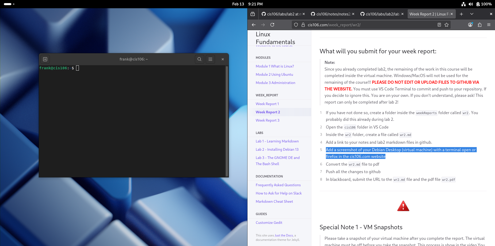

# Week Report 2

## Local file path
* [Notes 2](../../notes/notes2/notes2.md)
* [Lab 2](../../labs/lab2/lab2.md)

## GitHub URL

* [Notes 2](https://github.com/frankiscoding/cis106/blob/main/notes/notes2/notes2.md)
* [Lab 2](https://github.com/frankiscoding/cis106/blob/main/labs/lab2/lab2.md)

## Debian Desktop
